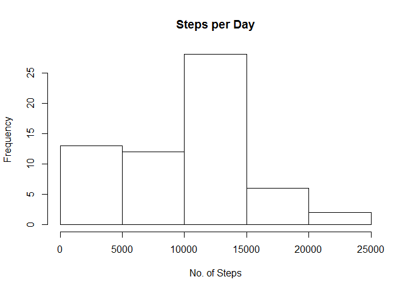
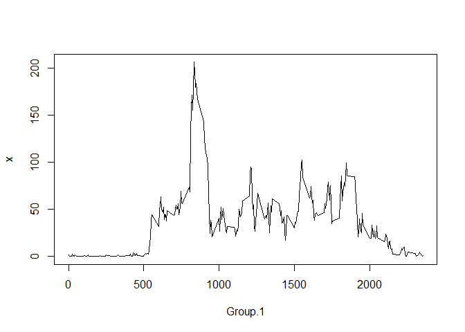
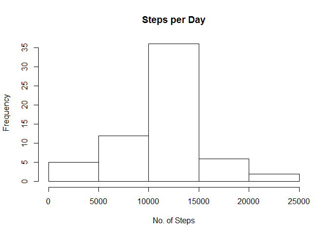
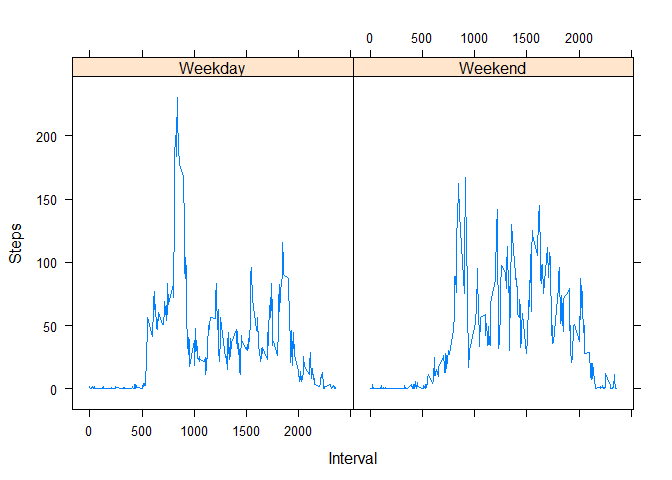

# Reproducible Research: Peer Assessment 1


## Loading and preprocessing the data


```r
activityData <- read.csv(unzip("activity.zip"))
```


## What is mean total number of steps taken per day?


###1. Total steps per day


```r
# use aggregate() to find mean and median 
      aggActivity <- aggregate(activityData$steps, by=list(activityData$date),FUN    ="sum",na.rm=TRUE)
    #mean and median
      meanAct <- mean(aggActivity[,2])
      medianAct <- median(aggActivity[,2]) 
```

### 2. Histogram

```r
hist(aggActivity[,2],main="Steps per Day",xlab="No. of Steps")
```

 

### 3. Mean and Median

```r
      paste("The mean value of total no. of steps each day: ",meanAct) 
```

```
## [1] "The mean value of total no. of steps each day:  9354.22950819672"
```

```r
      paste("The median value of total no. of steps each day: ",medianAct) 
```

```
## [1] "The median value of total no. of steps each day:  10395"
```


# What is the average daily activity pattern?

###   1. Time Series Plot

```r
  aggMeanActivity <- aggregate(activityData$steps, by=list(activityData$interval),FUN="mean",na.rm=TRUE)
  plot(aggMeanActivity,type='l')
```

 

###   2. Interval with max number of steps

```r
aggMeanActivity[aggMeanActivity[,2]==max(aggMeanActivity[,2]),1]
```

```
## [1] 835
```

## Imputing missing values

###   1. No. of rows with missing values


```r
nrow(activityData[!complete.cases(activityData),])
```

```
## [1] 2304
```

###   2&3. Fill missing NAs with mean of interval accross all days

```r
activityData2 <- activityData
activityData2[!complete.cases(activityData),1] <- aggMeanActivity[match(activityData2[!complete.cases(activityData),3],aggMeanActivity[,1]),2]
```
###   4. Mean, median and histogram

```r
aggActivity2 <- aggregate(activityData2$steps, by=list(activityData2$date),FUN="sum",na.rm=TRUE)
  #mean and median
  meanAct2 <- mean(aggActivity2[,2])
  medianAct2 <- median(aggActivity2[,2])
```


```r
### Mean and Median

      paste("The mean value of total no. of steps each day: ",meanAct2) 
```

```
## [1] "The mean value of total no. of steps each day:  10766.1886792453"
```

```r
      paste("The median value of total no. of steps each day: ",medianAct2) 
```

```
## [1] "The median value of total no. of steps each day:  10766.1886792453"
```

###Histogram 2

```r
  hist(aggActivity2[,2],main="Steps per Day",xlab="No. of Steps")
```

 

#### Imputing mising values increases the estimate of total daily number of steps. The original dataset with NAs had a downward impact on the mean due to data missing for intervals when the activity (no of steps) is high.


## Are there differences in activity patterns between weekdays and weekends?

### 1.  Factor which indicates weekend or weekday

```r
library(lattice)
logicWeekday <- lapply(activityData2[,2],f <- function(x) {if(weekdays(as.Date(x)) %in% c('Tuesday','Wednesday','Monday','Thursday','Friday')) {'Weekday'} else {'Weekend'}})
logicWeekday <- as.factor(unlist(logicWeekday))
activityData2 <- data.frame(activityData2,logicWeekday)
```

### 2.  Panel plot

```r
aggMeanActivity2 <- aggregate(activityData2$steps, by=list(activityData2$interval,activityData2$logicWeekday),FUN="mean",na.rm=TRUE)
print(xyplot(x~ Group.1|Group.2,aggMeanActivity2,type='l',xlab='Interval',ylab='Steps'))
```

 
